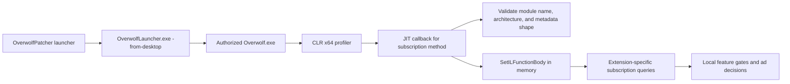

<div align="center">
  <h1>OverwolfPatcher</h1>
  <p>Shape-driven, in-memory CLR instrumentation for investigating local Overwolf extension feature gates.</p>

  <p>
    <a href="#project-stopping-point">Project status</a> •
    <a href="#getting-started">Getting started</a> •
    <a href="#how-it-works">How it works</a> •
    <a href="#validation-status">Validation</a> •
    <a href="#troubleshooting">Troubleshooting</a>
  </p>

  <p>
    <a href="#validation-status"></a>
    <a href="#requirements"></a>
    <a href="#how-it-works"></a>
    <a href="#requirements"></a>
  </p>
</div>

> [!IMPORTANT]
> **Development stopped here. The in-memory patch itself works for Outplayed
> (plan `61`) and Porofessor (plan `63`).** The only unresolved issue preventing
> the same mechanism from supporting other premium extensions is discovering
> each extension's exact plan ID without inspecting or hardcoding that
> extension. Overwolf's generic catalog does not expose records for every app,
> including the installed Outplayed and Porofessor versions, so those two IDs
> were known from the completed app-specific investigation rather than found by
> the automatic resolver. To run an instrumented session, launch
> `OverwolfPatcher.exe`; do **not** start Overwolf directly, because a normal
> Overwolf launch does not inherit the CLR profiler configuration. See
> [Project stopping point](#project-stopping-point) for everything investigated
> and the exact remaining boundary. It is technically possible for the
> community to build and maintain a verified UID-to-plan-ID registry for apps
> whose catalogs are empty. If enough people want broader coverage, that is a
> viable community effort, provided every mapping records its source and app
> version instead of guessing. The next engineering step would then be launch
> integration: make the user's normal Overwolf shortcut/protocol entry point
> start `OverwolfPatcher.exe`, which in turn starts Overwolf, rather than letting
> the user accidentally launch the uninstrumented Overwolf executable directly.

## Overview

Overwolf builds can reject a rewritten `OverWolf.Client.Core.dll` before login because rewriting changes the signed file. This project uses the CLR profiling API instead: the signed DLL remains unchanged on disk, while two compatible subscription methods are replaced in memory before the JIT compiles them.

The current adapter selects:

| Component | Runtime selection |
| --- | --- |
| Overwolf | Active managed assembly directory from launcher probing paths |
| Extensions | All valid 40-character IDs under the user-data `Extensions` directory |
| Core module | `OverWolf.Client.Core.dll`, selected by module name |
| Target methods | Metadata-identified `GetExtensionSubscriptions()` and `GetExtensionSubscriptionsIds()` |
| Compatibility | Required method/property signatures and IL shape |

Unknown metadata shapes, architectures, or required members are refused. Updates can still invalidate the adapter.

## Project stopping point

The last unresolved problem is plan discovery, not IL replacement. A legacy
extension normally asks `overwolf.profile.subscriptions` for the current user's
active plans. The patched Core method must return the exact numeric ID expected
by that extension. The ID is allocated in Overwolf's subscription catalog; it
cannot be calculated from the 40-character extension UID.

The final implementation queries the same generic UID-scoped catalog endpoint
used by the installed Overwolf Appstore:

```text
https://console-api.overwolf.com/v2/subscription-plans/app/<extension-id>
```

Overwolf's
[subscription-plan documentation](https://dev.overwolf.com/ow-native/developers-console/monetize/subs/subscription-plans/)
describes the plan ID assigned in the developer console. The
[profile subscriptions API](https://dev.overwolf.com/ow-native/reference/profile/subscriptions/)
returns active plans for the calling extension UID. Neither API derives a plan
ID from the UID. The current
[App Subscriptions API](https://dev.overwolf.com/ow-native/reference/subscriptions-api/)
uses Tebex `packageId` values under a separate store ID, so its values cannot be
used as legacy `planId` values.

When the endpoint returns numeric `id` records, the launcher creates a separate
UID-to-plan set for each extension and the native profiler injects the matching
result only behind that UID guard. Empty, malformed, or failed lookups are not
treated as evidence for any ID; the original Core methods remain active for
that extension. In-memory `instrument` rejects `--plans` so a caller cannot
silently turn this into another manual or global mapping mechanism.

### Sources and locations investigated

The investigation covered these generic sources before concluding that no
fallback exists for the two target apps:

| Source | What was checked | Result |
| --- | --- | --- |
| Installed extension manifests | `%LOCALAPPDATA%\Overwolf\Extensions\<UID>\<version>\manifest.json` | Outplayed and Porofessor declare profile/subscription permissions, but manifests contain no plan or store ID. |
| Overwolf package catalog cache | `%LOCALAPPDATA%\Overwolf\PackagesCache\ow_store_extensions.json` | Contains UID, version, title, download, targeting, and icon metadata; no subscription plan IDs. |
| Generic settings database | `%LOCALAPPDATA%\Overwolf\Settings\generic_settings.db` | Core metadata shows per-user keys shaped as `subs.<username>.<extensionId>` and `.v2`, but these cache server-issued subscriptions rather than the app's complete plan catalog. No usable records were present. |
| Chromium/CEF local storage | `%LOCALAPPDATA%\Overwolf\CefBrowserCache\Default\Local Storage\leveldb` | The observed subscription cache was empty; Porofessor's premium cache contained status/expiry data without a plan ID. |
| Application and Overwolf logs | `%LOCALAPPDATA%\Overwolf\Log` | Clean runs reported no active legacy/Tebex subscriptions. Later `61`/`63` entries were generated by the patch fixture and therefore were not authoritative discovery evidence. |
| Installed managed assemblies | `OverWolf.Client.Core.dll` and `Overwolf.Subscriptions.dll` | Metadata and IL expose active-subscription retrieval, storage, validation, and UID filtering. They do not expose a method that enumerates every configured plan for an extension. |
| Installed Overwolf Appstore | Its legacy subscription UI and content script | Revealed the generic UID-scoped catalog URL and its numeric `id` record contract. This is the source used by the resolver. |
| Legacy Overwolf profile API documentation and sample | `getActivePlans()`, `getDetailedActivePlans()`, and the official sample app | Results are scoped to the calling app and contain only a user's active plans. The sample itself supplies its known plan ID; it does not discover it. |
| Current App Subscriptions/Tebex API | Package, checkout, and active-subscription endpoints | Uses a separate store ID and `packageId` contract. No documented UID-to-store-ID lookup exists, and Tebex package IDs cannot be substituted for legacy plan IDs. |
| Installed Outplayed and Porofessor bundles | Bounded research used to confirm why historical fixtures `61` and `63` worked | This was extension-specific evidence, not a generic resolver. Runtime bundle scanning/deobfuscation was deliberately excluded from the final implementation. |

For the installed versions examined, the legacy catalog returned no records for
both Outplayed and Porofessor. Thus, if `61` and `63` had not already been known
from extension-specific investigation, this project could not have found them.
Calling those apps automatically supported would be misleading: the current
automatic path skips them.

The remaining theoretical sources all violate at least one final requirement:
a user-provided map, a compiled app allow-list, guessing likely integers,
extracting constants from each extension, or obtaining private developer
metadata. Work stopped rather than shipping one of those as automatic plan
resolution.

### Possible community continuation

A complete community-maintained mapping is technically possible even though a
complete automatic resolver is not. Contributors could verify an extension's
plan ID, associate it with the extension UID and tested version, and submit that
evidence to a reviewed registry. Enough contributions could eventually cover
most premium extensions. Such a registry would be a deliberate community data
project—not an authoritative value inferred by the patcher—and should reject
unverified or ambiguous entries.

#### How plans 61 and 63 were identified

Record the extension version and bundle hash before inspecting a candidate.
Offsets and minified line numbers change whenever an app updates. These were the
files used in this investigation:

| App | Installed bundle | SHA-256 |
| --- | --- | --- |
| Outplayed `175.3.12981` | `cghphpbjeabdkomiphingnegihoigeggcfphdofo\175.3.12981\background.js` | `BD77D930EC6FEEAF6619B5AFCC63E4D74DE74425F7444F90BFD6DE11F0658666` |
| Porofessor `2.16.17` | `pibhbkkgefgheeglaeemkkfjlhidhcedalapdggh\2.16.17\dist\porofessor-app.js` | `885BC7DE112C84A042D6B7D13E8197E48356588239F58BC1415A0EB0BB3BBE26` |

Start by finding the Overwolf subscription calls and the values used when their
results are checked:

```powershell
$extRoot = Join-Path $env:LOCALAPPDATA 'Overwolf\Extensions'
$outplayed = Join-Path $extRoot 'cghphpbjeabdkomiphingnegihoigeggcfphdofo\175.3.12981\background.js'
$porofessor = Join-Path $extRoot 'pibhbkkgefgheeglaeemkkfjlhidhcedalapdggh\2.16.17\dist\porofessor-app.js'

rg -n -S 'getActivePlans|getDetailedActivePlans|planId|subscriptionPlanId' $outplayed
rg -n -S 'getActivePlans|getDetailedActivePlans|kPremiumPlanId|planId' $porofessor
```

Outplayed's bundle is readable enough to follow directly. Around lines
69114–69115 it assigns `subscriptionPlanId = 61` beside the wrapper for
`overwolf.profile.subscriptions.getDetailedActivePlans`. The following code maps
the returned `planId` fields and checks whether they contain
`subscriptionPlanId`. Its subscription-change handler performs the same check.
That chain establishes `61` as the legacy plan used by the premium predicate.

Porofessor's bundle is a single obfuscated line, so searches can print several
megabytes of output. Read bounded sections around each match instead:

```powershell
$text = [IO.File]::ReadAllText($porofessor)

foreach ($needle in @(
  'getDetailedActivePlans',
  '_0x1d9b42[_0x3a3eac(0xd61)]=0x3f',
  '_0x5d97af[_0x26bf15(0x2732)][_0x26bf15(0x218a)]()'
)) {
  $position = $text.IndexOf($needle, [StringComparison]::Ordinal)
  "needle=$needle offset=$position"
  if ($position -ge 0) {
    $start = [Math]::Max(0, $position - 250)
    $text.Substring($start, [Math]::Min(900, $text.Length - $start))
  }
}
```

For that exact Porofessor hash, evaluating only its string-table decoder and
rotation setup in an isolated JavaScript VM resolves the relevant keys:

```text
_0x3a3eac(0xd61) = kPremiumPlanId
_0x3a3eac(0x218a) = getDetailedActivePlans
_0x3a3eac(0x427) = subscriptions
_0x3a3eac(0x9ca) = plans
_0x3a3eac(0x1df6) = planId
```

The assignment is therefore `kPremiumPlanId = 0x3f`, which is decimal `63`.
The premium service calls `getDetailedActivePlans()`, reads its `plans` array,
and searches for a record whose `planId` equals that constant.

A number is suitable for a community mapping only when this whole relationship
can be demonstrated in the same app version: a premium-plan constant, its use
in the premium decision, and a comparison against `planId` values returned by
the Overwolf profile subscription API. Decimal matches elsewhere in a bundle,
patched logs containing `Local premium test`, cached premium booleans, and IDs
chosen because they are near a known value are not evidence.

After that mapping effort, the practical next feature should be a safe launcher
integration. Overwolf must inherit the profiler environment from this program,
so opening `Overwolf.exe` directly bypasses the patch. A future implementation
could install an opt-in shortcut or protocol/launcher handoff that points to
`OverwolfPatcher.exe`; the patcher would resolve the plans, configure the CLR
profiler, and then start Overwolf. It should preserve an obvious way to launch
Overwolf normally and avoid modifying the signed Overwolf binaries themselves.

## What changed from the previous approach

The earlier implementation used Mono.Cecil to rewrite Core on disk. Even when the rewrite was limited to the two subscription methods, the resulting file no longer satisfied the launcher’s verification path and also lost the publisher Authenticode signature. A no-op Cecil round trip was enough to fail the relevant offline predicate, so reducing the number of edited instructions could not make that design reliable.

The current implementation keeps the installed Core file byte-for-byte unchanged. A native x64 CLR profiler receives JIT callbacks for the authorized `Overwolf.exe` process, resolves the target methods and members from metadata, and supplies equivalent or premium IL through `SetILFunctionBody` before compilation. The change lasts for the current instrumented session and is not persisted by the patcher.

| Previous on-disk rewrite | Current CLR profiler |
| --- | --- |
| Writes a modified Core DLL | Leaves signed files unchanged |
| Runs before Overwolf starts | Runs during CLR startup and JIT compilation |
| Subject to launcher file verification | Uses the CLR profiling API in process memory |
| Could require restore after every attempt | Ends when the instrumented process exits |
| Could not preserve the current publisher signature | Does not alter the publisher-signed file |
| Broad legacy patch sequence | Two metadata-identified subscription methods |

## Features

- x64 native CLR profiler with architecture and target metadata-shape checks.
- Process isolation: profiling is intended for the authorized managed `Overwolf.exe` child launched by `OverwolfLauncher.exe -from-desktop`.
- Diagnostic modes for separating startup, callback, flag, and IL-replacement failures.
- `neutral` mode that preserves the reviewed original behavior while testing replacement mechanics.
- `premium` mode that resolves each installed extension against Overwolf's UID-scoped legacy subscription catalog and emits only that extension's returned plan IDs.
- Original IL, locals, branches, exception regions, and method metadata are retained where required by the adapter.
- Inlining and NGEN are disabled process-wide for instrumented launches so the replacement can be observed before JIT compilation.
- x64 fixture and offline tests for both target methods.

## How it works



Only the local decision path is affected. Outplayed may still display `Outplayed Core - Free`: its aggregate plan selector excludes active legacy Overwolf plans even though the subscription boolean accepts the injected plan. The observed result was that “Go Premium” disappeared, ads were absent, and local premium features appeared unlocked while the account screen remained Free. This does not create a Tebex subscription or grant server-side storage, upload retention, or cross-device entitlements.

## Getting started

### Requirements

- Windows with an x64 Overwolf installation.
- .NET 8 SDK for building the launcher and tests.
- .NET Framework 4.8 runtime.
- Visual Studio x64 C++ build tools and Windows SDK for the native profiler.
- A normal interactive Windows account that owns the Overwolf profile and can access its CEF and Crashpad data.
- A signed-in Overwolf account for testing the login-dependent code path.

### Build

Run from the repository root:

```powershell
.\build\build.ps1
```

Build and run the offline tests plus the x64 profiler fixture:

```powershell
.\build\build.ps1 -Test
```

If native Visual Studio tools are unavailable, `-SkipProfiler` skips the native build only; the CLI commands remain present but cannot run a live profiler until its x64 DLL is built.

The test build currently passes. `NU1900` warnings may appear when NuGet cannot reach its vulnerability index; they are dependency-index warnings, not test failures.

### Baseline and instrumentation

After building, run from the executable directory and close existing Overwolf processes before each run:

With no arguments, the launcher resolves legacy subscription plans per installed
extension ID under the Overwolf user-data `Extensions` directory. Extensions
with no catalog plans are reported and left unchanged; if none have discoverable
legacy IDs, no process is launched. This is equivalent to:

```powershell
.\OverwolfPatcher.exe instrument --mode premium --all-extensions
```

Add `--verbose --wait-ms 5000` to print each catalog lookup, extension attempt,
skip, and profiler runtime result after launch. `--all-extensions` enables
verbose output automatically, while a bare launch still returns immediately
unless a wait time is provided.

```powershell
cd .\OverwolfPatcher\bin\Release\net48
.\OverwolfPatcher.exe baseline --entry launcher --wait-ms 5000
.\OverwolfPatcher.exe baseline --entry managed --wait-ms 5000
```

Use the diagnostic modes in order when investigating a new installation or build:

```powershell
.\OverwolfPatcher.exe instrument --mode bootstrap --wait-ms 5000
.\OverwolfPatcher.exe instrument --mode observe --wait-ms 5000
.\OverwolfPatcher.exe instrument --mode flags --wait-ms 5000
```

After the baseline and diagnostics succeed, test the neutral and local premium modes:

```powershell
.\OverwolfPatcher.exe instrument --mode neutral
.\OverwolfPatcher.exe instrument --mode premium --all-extensions
```

`baseline` launches without profiling and captures visible Overwolf window text. `bootstrap` tests profiler startup, `observe` records modules and callbacks, and `flags` adds CLR flags without replacing method bodies. `neutral` replaces both methods with equivalent original IL. `premium` resolves per-extension legacy catalog IDs before applying the metadata-shape-checked in-memory replacements. Logs are written under `artifacts\profiler` unless an explicit log path is provided.

Use `--all-extensions` with `instrument --mode premium` to select every valid
installed extension ID. `--data DIR` overrides the user-data directory when
the default registry or `%LOCALAPPDATA%\Overwolf` location is not the one in
use. The launcher asks Overwolf's legacy catalog for each app's plan IDs. A
separate provider, a migrated app, an empty response, or an unavailable catalog
is reported as unsupported and retains the original Core behavior. In-memory
premium mode rejects `--plans`; it never falls back to caller-provided IDs.

The older commands remain available for offline compatibility inspection:

```powershell
.\OverwolfPatcher.exe status --app EXTENSION_ID --plans 1,2
.\OverwolfPatcher.exe stage --app EXTENSION_ID --plans 1,2
```

These compatibility commands are separate from automatic premium instrumentation. `apply` remains an on-disk compatibility test and can still be rejected by assembly/signature guards; it is not used by the profiler workflow. The legacy `restore --backup PATH` command still performs guarded restoration of old on-disk patch backups; the CLR profiler itself does not require installation changes or restoration.

## Validation status

The synthetic x64 fixture has replaced both methods before JIT, and the managed/native build and offline tests pass. Live validation on the profile-owning account reached the real Core methods: `SetILFunctionBody` succeeded for both methods, and the detailed method was observed completing JIT. The ID-returning method’s independent live invocation was not observed; the app behavior matched the local premium fixture.

The independently observed live evidence includes:

- “Go Premium” no longer appeared.
- Ads were not visible during the tested session.
- Local premium features appeared available.
- The plan screen still reported `Outplayed Core - Free`.

The ID-returning method was not independently observed through a separate live execution trace. The profiler’s patch is expected to end when the instrumented process exits; persistence of Outplayed’s selected layout settings after a full restart has not been verified. Uploads, remote media, retention, and other server-backed benefits have not been established. Treat this as a local feature-gate experiment, not proof of an account subscription.

## Troubleshooting

### `Failed to initialize CEF runtime`

Run the baseline and instrumented commands as the interactive account that owns the Overwolf profile. In our tests, a restricted automation account lacked access to Crashpad or CEF data and failed before Outplayed reached the subscription methods. Treat that as an execution-context issue in those tests, not as a universal Overwolf failure.

### “Go Premium” still appears

Confirm that Overwolf was started by the instrument command, that all existing Overwolf processes were closed, and that the profiler log records the compatible Core metadata shape, both `SetILFunctionBody` results, and a fresh PID. Ordinary shortcut launches do not inherit the profiling environment.

### The plan screen says Free

That is expected for this fixture. The local premium boolean and the visible aggregate plan are separate code paths; the aggregate selector excludes active legacy Overwolf plans. This project does not modify the account or fabricate a Tebex response.

### The profiler cannot find the subscription API

Record the installed Overwolf and Outplayed versions, architecture, required method/property signatures, and profiler log. The profiler refuses to patch when the expected subscription metadata shape is missing.

### Updates remove the behavior

The profiler is process-local and has no persistent upgrade mechanism. Restart the instrumented command after every Overwolf update and review the metadata-shape result in the log.

## Project layout

```text
native/                         x64 CLR profiler and compatibility interfaces
OverwolfPatcher/Commands/       launcher, metadata discovery, and diagnostic commands
OverwolfPatcher/Legacy/         retained historical workflow
OverwolfPatcher.Runtime/        retired compatibility stub; unsafe redirects refused
tests/ProfilerFixture/          synthetic Core-shaped assembly
tests/ProfilerHarness/          profiler startup/JIT harness
docs/                           compatibility evidence and attempt history
build/build.ps1                 managed/native build and test entry point
```

## Evidence and historical context

- [Compatibility investigation report](docs/compatibility-investigation-report.md)
- [Compatibility test battery](docs/compatibility-test-battery.md)
- [Attempt log](docs/attempt-log.md)

The project originated from the OverwolfInsiderPatcher work associated with [Decode](https://github.com/DecoderCoder/OverwolfInsiderPatcher) and [Bluscream](https://github.com/Bluscream/OverwolfInsiderPatcher). Historical mirrors and old premium claims are intentionally not reproduced here; they describe the on-disk patcher and do not describe the current profiler architecture.

## License

No license file or explicit license declaration is currently present in this repository. All rights remain with the repository’s contributors and applicable upstream copyright holders.
