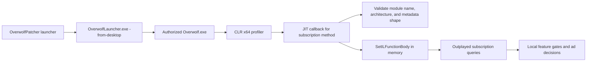

<div align="center">
  <h1>OverwolfPatcher</h1>
  <p>Shape-driven, in-memory CLR instrumentation for investigating local Overwolf extension feature gates.<br><b>You can also read the research on how I built this here: <br>https://www.brunotrigueiro.com/writing/cracking-overwolf-when-modifying-the-binary-stops-working/</b></p>

  <p>
    <a href="#getting-started">Getting started</a> •
    <a href="#how-it-works">How it works</a> •
    <a href="#validation-status">Validation</a> •
    <a href="#troubleshooting">Troubleshooting</a>
  </p>

  <p>
    <a href="#validation-status"></a>
    <a href="#requirements"></a>
    <a href="#how-it-works"></a>
    <a href="#requirements"></a>
  </p>
  <p>
    <a href="#getting-started">Getting started</a> •
    <a href="#how-it-works">How it works</a> •
    <a href="#validation-status">Validation</a> •
    <a href="#troubleshooting">Troubleshooting</a>
  </p>
</div>

> [!WARNING]
> This is an experimental research tool. It changes managed method bodies in a running process and is not an Overwolf-supported extension. It uses metadata shape checks instead of a version allow-list, so updates can still be incompatible. Do not use it to represent a paid account entitlement.

## Overview

Overwolf builds can reject a rewritten `OverWolf.Client.Core.dll` before login because rewriting changes the signed file. This project uses the CLR profiling API instead: the signed DLL remains unchanged on disk, while two compatible subscription methods are replaced in memory before the JIT compiles them.

The current adapter selects:

| Component | Runtime selection |
| --- | --- |
| Overwolf | Active managed assembly directory from launcher probing paths |
| Extensions | All valid 40-character IDs under the user-data `Extensions` directory |
| Core module | `OverWolf.Client.Core.dll`, selected by module name |
| Target methods | Metadata-identified `GetExtensionSubscriptions()` and `GetExtensionSubscriptionsIds()` |
| Compatibility | Required method/property signatures and IL shape |

Unknown metadata shapes, architectures, or required members are refused. Updates can still invalidate the adapter.

## What changed from the previous approach

The earlier implementation used Mono.Cecil to rewrite Core on disk. Even when the rewrite was limited to the two subscription methods, the resulting file no longer satisfied the launcher’s verification path and also lost the publisher Authenticode signature. A no-op Cecil round trip was enough to fail the relevant offline predicate, so reducing the number of edited instructions could not make that design reliable.

The current implementation keeps the installed Core file byte-for-byte unchanged. A native x64 CLR profiler receives JIT callbacks for the authorized `Overwolf.exe` process, resolves the target methods and members from metadata, and supplies equivalent or premium IL through `SetILFunctionBody` before compilation. The change lasts for the current instrumented session and is not persisted by the patcher.

| Previous on-disk rewrite | Current CLR profiler |
| --- | --- |
| Writes a modified Core DLL | Leaves signed files unchanged |
| Runs before Overwolf starts | Runs during CLR startup and JIT compilation |
| Subject to launcher file verification | Uses the CLR profiling API in process memory |
| Could require restore after every attempt | Ends when the instrumented process exits |
| Could not preserve the current publisher signature | Does not alter the publisher-signed file |
| Broad legacy patch sequence | Two metadata-identified subscription methods |

## Features

- x64 native CLR profiler with architecture and target metadata-shape checks.
- Process isolation: profiling is intended for the authorized managed `Overwolf.exe` child launched by `OverwolfLauncher.exe -from-desktop`.
- Diagnostic modes for separating startup, callback, flag, and IL-replacement failures.
- `neutral` mode that preserves the reviewed original behavior while testing replacement mechanics.
- `premium` mode that returns configured local plan fixtures. Outplayed uses plan `61`; Porofessor uses plan `63`.
- Original IL, locals, branches, exception regions, and method metadata are retained where required by the adapter.
- Inlining and NGEN are disabled process-wide for instrumented launches so the replacement can be observed before JIT compilation.
- x64 fixture and offline tests for both target methods.

## TODO

- [ ] Replace the provisional shared `--plans` list with per-extension plan
  resolution. The patcher must not guess that every extension uses Outplayed's
  plan `61` or Porofessor's plan `63`; investigate what in each extension's
  subscription/premium implementation determines its plan ID, then generate
  the matching result for every extension selected by `--all-extensions`.

## How it works



Only the local decision path is affected. Outplayed may still display `Outplayed Core - Free`: its aggregate plan selector excludes active legacy Overwolf plans even though the subscription boolean accepts the injected plan. The observed result was that “Go Premium” disappeared, ads were absent, and local premium features appeared unlocked while the account screen remained Free. This does not create a Tebex subscription or grant server-side storage, upload retention, or cross-device entitlements.

## Getting started

### Requirements

- Windows with an x64 Overwolf installation.
- .NET 8 SDK for building the launcher and tests.
- .NET Framework 4.8 runtime.
- Visual Studio x64 C++ build tools and Windows SDK for the native profiler.
- A normal interactive Windows account that owns the Overwolf profile and can access its CEF and Crashpad data.
- A signed-in Overwolf account for testing the login-dependent code path.

### Build

Run from the repository root:

```powershell
.\build\build.ps1
```

Build and run the offline tests plus the x64 profiler fixture:

```powershell
.\build\build.ps1 -Test
```

If native Visual Studio tools are unavailable, `-SkipProfiler` skips the native build only; the CLI commands remain present but cannot run a live profiler until its x64 DLL is built.

The test build currently passes. `NU1900` warnings may appear when NuGet cannot reach its vulnerability index; they are dependency-index warnings, not test failures.

### Baseline and instrumentation

After building, run from the executable directory and close existing Overwolf processes before each run:

With no arguments, the launcher uses the local premium fixture for every
installed extension ID it finds under the Overwolf user-data `Extensions`
directory. This is equivalent to:

```powershell
.\OverwolfPatcher.exe instrument --mode premium --all-extensions --plans 61,63
```

Add `--verbose --wait-ms 5000` to print each configured extension attempt and
the profiler's runtime results after launch. A bare launch enables verbose
output automatically, but returns immediately unless a wait time is provided.

```powershell
cd .\OverwolfPatcher\bin\Release\net48
.\OverwolfPatcher.exe baseline --entry launcher --wait-ms 5000
.\OverwolfPatcher.exe baseline --entry managed --wait-ms 5000
```

Use the diagnostic modes in order when investigating a new installation or build:

```powershell
.\OverwolfPatcher.exe instrument --mode bootstrap --wait-ms 5000
.\OverwolfPatcher.exe instrument --mode observe --wait-ms 5000
.\OverwolfPatcher.exe instrument --mode flags --wait-ms 5000
```

After the baseline and diagnostics succeed, test the neutral and local premium modes:

```powershell
.\OverwolfPatcher.exe instrument --mode neutral
.\OverwolfPatcher.exe instrument --mode premium `
  --app cghphpbjeabdkomiphingnegihoigeggcfphdofo `
  --plans 61
```

`baseline` launches without profiling and captures visible Overwolf window text. `bootstrap` tests profiler startup, `observe` records modules and callbacks, and `flags` adds CLR flags without replacing method bodies. `neutral` replaces both methods with equivalent original IL. `premium` uses the local legacy plan fixture after the metadata-shape checks. Logs are written under `artifacts\profiler` unless an explicit log path is provided.

Use `--all-extensions` with `instrument --mode premium` to select every valid
installed extension ID. `--data DIR` overrides the user-data directory when
the default registry or `%LOCALAPPDATA%\Overwolf` location is not the one in
use. Plan `61` is the reviewed Outplayed fixture; applying that same local
value to every extension is supported, but individual apps may use different
plan IDs or subscription providers and therefore may not react to it.

The older commands remain available for offline compatibility inspection:

```powershell
.\OverwolfPatcher.exe status
.\OverwolfPatcher.exe stage
```

`apply` remains an on-disk compatibility test and can still be rejected by assembly/signature guards; it is not required for the profiler workflow. The legacy `restore --backup PATH` command still performs guarded restoration of old on-disk patch backups; the CLR profiler itself does not require installation changes or restoration.

## Validation status

The synthetic x64 fixture has replaced both methods before JIT, and the managed/native build and offline tests pass. Live validation on the profile-owning account reached the real Core methods: `SetILFunctionBody` succeeded for both methods, and the detailed method was observed completing JIT. The ID-returning method’s independent live invocation was not observed; the app behavior matched the local premium fixture.

The independently observed live evidence includes:

- “Go Premium” no longer appeared.
- Ads were not visible during the tested session.
- Local premium features appeared available.
- The plan screen still reported `Outplayed Core - Free`.

The ID-returning method was not independently observed through a separate live execution trace. The profiler’s patch is expected to end when the instrumented process exits; persistence of Outplayed’s selected layout settings after a full restart has not been verified. Uploads, remote media, retention, and other server-backed benefits have not been established. Treat this as a local feature-gate experiment, not proof of an account subscription.

## Troubleshooting

### `Failed to initialize CEF runtime`

Run the baseline and instrumented commands as the interactive account that owns the Overwolf profile. In our tests, a restricted automation account lacked access to Crashpad or CEF data and failed before Outplayed reached the subscription methods. Treat that as an execution-context issue in those tests, not as a universal Overwolf failure.

### “Go Premium” still appears

Confirm that Overwolf was started by the instrument command, that all existing Overwolf processes were closed, and that the profiler log records the compatible Core metadata shape, both `SetILFunctionBody` results, and a fresh PID. Ordinary shortcut launches do not inherit the profiling environment.

### The plan screen says Free

That is expected for this fixture. The local premium boolean and the visible aggregate plan are separate code paths; the aggregate selector excludes active legacy Overwolf plans. This project does not modify the account or fabricate a Tebex response.

### The profiler cannot find the subscription API

Record the installed Overwolf and Outplayed versions, architecture, required method/property signatures, and profiler log. The profiler refuses to patch when the expected subscription metadata shape is missing.

### Updates remove the behavior

The profiler is process-local and has no persistent upgrade mechanism. Restart the instrumented command after every Overwolf update and review the metadata-shape result in the log.

## Project layout

```text
native/                         x64 CLR profiler and compatibility interfaces
OverwolfPatcher/Commands/       launcher, metadata discovery, and diagnostic commands
OverwolfPatcher/Legacy/         retained historical workflow
OverwolfPatcher.Runtime/        retired compatibility stub; unsafe redirects refused
tests/ProfilerFixture/          synthetic Core-shaped assembly
tests/ProfilerHarness/          profiler startup/JIT harness
docs/                           compatibility evidence and attempt history
build/build.ps1                 managed/native build and test entry point
```

## Evidence and historical context

- [Compatibility investigation report](docs/compatibility-investigation-report.md)
- [Compatibility test battery](docs/compatibility-test-battery.md)
- [Attempt log](docs/attempt-log.md)

The project originated from the OverwolfInsiderPatcher work associated with [Decode](https://github.com/DecoderCoder/OverwolfInsiderPatcher) and [Bluscream](https://github.com/Bluscream/OverwolfInsiderPatcher). Historical mirrors and old premium claims are intentionally not reproduced here; they describe the on-disk patcher and do not describe the current profiler architecture.

## License

No license file or explicit license declaration is currently present in this repository. All rights remain with the repository’s contributors and applicable upstream copyright holders.
